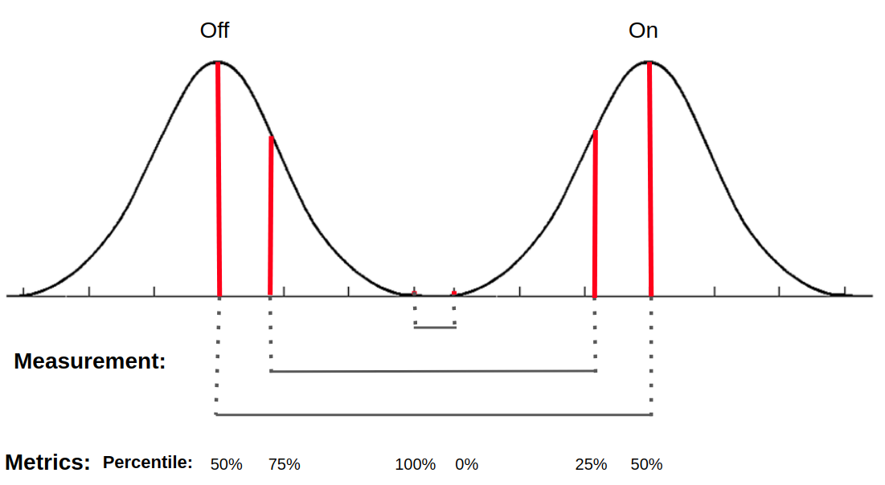

# Performance Metrics

Measures of circuit performance for experiments - for both aggregate and per sample values

groups by:
* experiment_id, strain_id  
* experiment_id, strain_id, time series
* experiment_id, strain_id, time series, replicates
* by transitions (in development)


For the above groupings, multiple metrics are computed. The metrics capture the difference between the ON state and the 
OFF state, as measured by different statistical characterizations of the distributions.

**Metrics for Aggregated Samples**: These metrics compare the full on and off groups for each grouping.

* percentiles: Comparing the left versus right hand side of the distribution via percentiles, i.e.  for the OFF, use q 
to get right hand side of dist; for ON, use 1 - q to get left hand side of dist. 



* standard deviation (+/- 1, 2, 3 SD): Comparing the left versus right hand side of the distribution via standard 
deviation, i.e.  for the OFF, use xbar + n*SD to get right hand side of dist; for ON, use xbar - n*SD to get left hand 
side of dist. 


For each metric we take the difference and ratios of the left/right sides of the distributions for comparison.

**Important Note On Graphics:** The normal distribution is used purely for illustrative purposes - we make no 
assumptions about the distribution of the data. 

**Per Sample Metrics**: These metrics are very similar to the aggregate metrics except a value is computed for each 
value in the off/on group. In particular, for each individual on, we look at its difference (or ratio) to the
median of the off states and then vice versa for each of the off samples.

### Authors
Geometric Data Analytics, Inc.  
* Anastasia Deckard 
* Tessa Johnson
## User Guide
### Install

**Option 1: Conda**: This installation method assumes that the user has conda previously installed on their 
computer. If you do not, you can choose to install conda with Miniconda or Anaconda 
[here](https://docs.conda.io/projects/conda/en/latest/user-guide/install/download.html).
```
cd perform_metrics
conda env create -f conda_env.yml
source activate sd2-perform_metrics
pip install .
```

**Option 2: Docker**: This installation method assumes that users have docker previously installed on their computer.
If you do not, see the documentation [here](https://docs.docker.com/get-docker/).
```
cd perform_metrics
docker build . -t sd2_gda_perform_metrics
# if you want to enter the container to use the code
docker run --name perform_metrics -i -t sd2_gda_perform_metrics
```


### Config File
* observed_output: name of column with numeric values, measurements from experiment (e.g. fluorescence)
* intended_output
    * col: column name that contains the intended output, e.g. "inducer_concentration_mM"
    * off: values in the column that are the off label, e.g. "0", "0.0" or if you want to run a series of data files 
    you can put more general values (specifically "max", "min")
    * on: values in the column that mean it is on, e.g. "1", "0.004" or if you want to run a series of data files 
    you can put more general values (specifically "max", "min")
* group_cols_dict : dict of groupings to run metrics on
    * group name : list of columns to group by
    e.g. 
     ```
     "group_cols_dict": {
        "str_tp": [
          "strain_name",
          "sampling_timepoint_h"
        ],
        "prj_tp": [
          "TX_project_name",
          "sampling_timepoint_h"
        ]
    }
  ```
See `example/example_config.json` for an example config file.
    
    
### Input Data/data_path
input data should be in the format:
  * csv
  * samples in rows
  * variables in columns
  * column specified as observed_output must have numeric values

See `example/synthetic_data.csv` for an example input data set.

## Merge Files
Users can input an optional metadata file if their input data file doesn't contain this information. These files should
be in the format:
  * csv
  * samples in rows
  * variables in columns
  * contain a sample_id column that can merged on (your input data should also have a sample_id column)
  
See `example/synthetic_metadata.csv` for an example input data set.

### Run 
Command Line Arguments
* config_file: config file
* data_path: input file with data
* output_dir: directory for output
* (optional) --no_sub_dir: do not make a subdirectory (not recommended except for reactor) 
* (optional) --merge_files: if there is a seperate metadata file, specify its location here

```
python run_analysis.py config_file data_path output_dir --no_sub_dir --merge_files file 
```  

### Output Data
After running our analysis, users will find the following files in a directory called {original_data_file}_{timestamp} in wherever the output path 
was specified in the config file:

* {config}.json: the configuration file input by the user
* {config}_evaluated.json: the configuration file evaluated by the code (this is only different from the {config}.json
if the min/max options are used in on/off)
* tsv files used for aggregate metrics: These compare the distances between all the on vs off values in each group.
There should be two of these for each group - one for the percentile statistics and one for the sd statistics. 
    * First few columns correspond to the variable listed in config within the 'group_cols_dict' section
    * `group_name`: which group (consisting of the combinations of the columns listed in the group_cols_dict) is being 
    analyzed.
    * `off_count`: number of values associated with the off state
    * `on_count`: number of values associated with the on state
    * `num_std`(/`percentile`): Number of standard deviations away from the mean used to compute metrics 
    (/percentile used for metrics)
    * `off_agg`: distribution value associated with either percentile (q) or mean + num_std*standard deviation
    * `on_agg`:  distribution value associated with either 1-percentile (q) or mean - num_std*standard deviation
    * `diff`: difference between on_agg and off_agg 
    * `ratio`:  ratio between on_agg and off_agg (on_agg / off_agg)
* tsv files used for per sample metrics: For each individual on, we want to look at its difference to the median 
of the off states and then vice versa for each of the off samples.
    * First few columns correspond to the variable listed in config within the 'group_cols_dict' section
    * `group_name`: which group (consisting of the combinations of the columns listed in the group_cols_dict) is being 
    analyzed.
    * `off_count`: number of values associated with the off state (this should 1 or the total number of off values)
    * `on_count`: number of values associated with the on state (this should 1 or the total number of on values)
    * `percentile`: This should be the 50th percentile (the median)
    * `sample_id`: The sample id for the individual sample being analyzed
    * `off_agg`: either the individual off value or the median off value 
    * `on_agg`:  either the individual on value or the median on value
    * `diff`: difference between on_agg and off_agg 
    * `ratio`:  ratio between on_agg and off_agg (on_agg / off_agg)
* histograms of fold change data: for each group_cols combination listed in the config, a histogram is produced tabulating
the number of groups that have certain ratios of on/off
* boxplot of on vs. off: for each group_cols combination listed in the config, stacked boxplots comparing the distribution 
of on values vs. the distribution of off values is displayed 
    